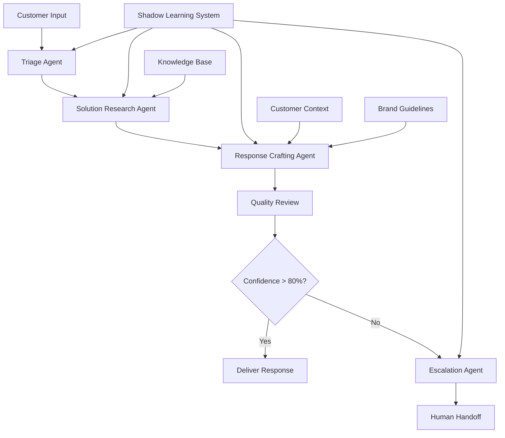

# Kyoryoku (協力) - Product Requirements Document

## Version 3.0 - Strategic Research Prototype for Agentic Team Validation

**Document Status**: Source of Truth | **Last Updated**: December 2024 | **Next Review**: January 2025

---

## Version History

| Version | Date     | Changes                                                                                      | Author           |
| ------- | -------- | -------------------------------------------------------------------------------------------- | ---------------- |
| 3.0     | Dec 2024 | Complete strategic rewrite with market validation, business model, technical risk assessment | Strategic Review |
| 2.0     | Nov 2024 | Added use case frameworks, shadow learning system, detailed architecture                     | Initial Research |
| 1.0     | Oct 2024 | Initial concept and basic research objectives                                                | Concept Phase    |

---

## 1. Executive Summary

**Kyoryoku** (協力 - "cooperation/collaboration") is a strategic research platform for validating the commercial viability of multi-agent AI systems. This PRD defines requirements for a **focused validation prototype** that tests specific high-value use cases with rigorous market and technical validation.

The name reflects our core hypothesis: that AI agents working in harmony (和) through mutual cooperation (協力) can deliver measurable business value that justifies premium pricing, much like how omotenashi emerges from coordinated human teams.

**Document Purpose**: Define a strategic prototype for validating specific multi-agent use cases with clear paths to product-market fit and sustainable business models.

### Strategic Focus

Based on preliminary market research, we are **prioritizing Customer Success Response Teams** as our primary validation target, with **RFP/Proposal Acceleration** as secondary validation. This focus allows us to:

- Target markets with urgent, quantifiable pain points
- Validate willingness to pay premium pricing ($500-2000/month)
- Build defensible technical moats through domain specialization
- Achieve measurable ROI within 90-day pilot periods

---

## 2. Market Analysis & Strategic Positioning

### 2.1 Use Case Prioritization Matrix

| Use Case                  | Market Size | Pain Urgency  | Technical Feasibility | Competitive Moat | Total Score | Priority      |
| ------------------------- | ----------- | ------------- | --------------------- | ---------------- | ----------- | ------------- |
| Customer Success Teams    | $15B        | High (8/10)   | Medium (6/10)         | High (8/10)      | 22/30       | **PRIMARY**   |
| RFP/Proposal Acceleration | $8B         | High (9/10)   | Medium (7/10)         | Medium (6/10)    | 22/30       | **SECONDARY** |
| Product Intelligence      | $12B        | Medium (6/10) | High (8/10)           | Low (4/10)       | 18/30       | Tertiary      |
| Knowledge Transfer        | $5B         | Medium (5/10) | Low (4/10)            | Medium (6/10)    | 15/30       | Deprioritized |
| Market Intelligence       | $6B         | Low (4/10)    | Medium (6/10)         | Low (3/10)       | 13/30       | Deprioritized |

### 2.2 Competitive Landscape

#### Direct Competitors

- **Intercom Resolution Bot**: Single-agent, limited to scripted responses
- **Zendesk Answer Bot**: Rule-based, no learning capability
- **Microsoft Copilot Studio**: General-purpose, lacks domain specialization
- **OpenAI Assistants API**: Developer tool, requires significant customization

#### Competitive Advantages

1. **Domain-Specialized Teams**: Pre-built agents trained for specific workflows
2. **Shadow Learning System**: Unique onboarding approach that captures institutional knowledge
3. **Multi-Agent Coordination**: Handles complex tasks requiring multiple skill sets
4. **Human-AI Collaboration**: Seamless handoffs and escalation protocols

### 2.3 Target Customer Segments

#### Primary: Customer Success Teams (50-500 people)

**Personas**:

- **Sarah - CS Operations Manager**: Struggles with ticket volume scaling 200%+ annually
- **Mike - CS Rep**: Spends 60% of time researching answers, wants to focus on relationship building
- **Lisa - CS Director**: Needs to maintain quality while reducing per-ticket costs

**Pain Points**:

- Average ticket resolution: 18 minutes (target: 3 minutes)
- Knowledge fragmentation across 15+ systems
- Inconsistent response quality across team members
- New hire onboarding takes 12-16 weeks

**Value Proposition**: Reduce average ticket resolution time by 70% while improving response quality and consistency.

#### Secondary: Sales/BD Teams Handling RFPs

**Personas**:

- **David - Sales Engineer**: Drowning in 20+ RFPs per quarter
- **Rachel - Proposal Manager**: Manually assembles responses from scattered content
- **Tom - BD Director**: Loses deals due to slow response times

**Pain Points**:

- RFP response takes 80-120 hours of effort
- Miss 30% of RFPs due to resource constraints
- Inconsistent messaging across proposals
- Win rates suffer when rushed

**Value Proposition**: Complete comprehensive RFP responses in 4-6 hours instead of 80-120 hours.

---

## 3. Customer Discovery & Validation Framework

### 3.1 Customer Research Plan

#### Phase 1: Problem Validation (Weeks 1-2)

**Target**: 50 interviews per primary use case (100 total)

**Customer Success Interviews**:

- 25 CS Operations Managers (companies with 50-500 support agents)
- 15 CS Directors (companies scaling support teams)
- 10 CS Representatives (front-line experience)

**RFP Acceleration Interviews**:

- 25 Sales Engineers (B2B companies with complex products)
- 15 Proposal Managers (professional services firms)
- 10 BD Directors (enterprise software companies)

**Interview Framework**:

```markdown
### Pain Point Validation

1. Walk me through your typical [support ticket/RFP response] process
2. What's the most frustrating part of this workflow?
3. How much time does [average ticket/typical RFP] take?
4. What tools have you tried to solve this?
5. If you could save 70% of this time, what would that be worth?

### Willingness to Pay

6. What do you currently spend on [support tools/proposal software]?
7. How much would you pay for a solution that saves [X hours per month]?
8. What ROI would justify a $1000/month investment?
9. Who would need to approve a purchase like this?
10. What would a successful pilot look like?
```

#### Phase 2: Solution Validation (Weeks 5-6)

**Target**: 20 solution demos with high-intent prospects

**Demo Script**:

- Show current state (human workflow)
- Demonstrate agent team in action
- Compare results side-by-side
- Discuss pricing and pilot terms

#### Phase 3: Pilot Validation (Weeks 7-12)

**Target**: 3-5 pilot customers per use case

**Pilot Success Criteria**:

- 50%+ time reduction on target tasks
- 70%+ customer satisfaction with agent outputs
- 80%+ retention rate after 90 days
- Clear ROI demonstration

### 3.2 Product-Market Fit Validation

#### Quantitative PMF Metrics

- **Customer Willingness to Pay**: 60%+ would pay $500+/month after seeing demo
- **Time Savings**: 50%+ reduction in task completion time
- **Quality Maintenance**: 85%+ match human evaluation scores
- **User Retention**: 70%+ weekly active usage after 30 days
- **NPS Score**: 50+ among pilot customers

#### Qualitative PMF Indicators

- Customers proactively expand usage to additional use cases
- Word-of-mouth referrals from pilot customers
- Customers request integration with additional systems
- Resistance to removing system after pilot period

---

## 4. Research Hypotheses & Validation Framework

### 4.1 Core Hypotheses (Prioritized)

#### H1: Multi-Agent Teams Deliver Superior ROI vs Single Agents [PRIMARY]

**Test**: Compare specialized team vs. single generalist agent on customer support tasks
**Metrics**:

- Task completion rate (target: 85% vs 60%)
- Quality scores (target: 4.2/5 vs 3.6/5)
- Time to resolution (target: 3 min vs 8 min)
  **Statistical Framework**: N=100 tickets per condition, p<0.05 significance

#### H2: Shadow Learning Creates Sustainable Competitive Moats [PRIMARY]

**Test**: Measure agent performance improvement and knowledge capture depth
**Metrics**:

- Pattern discovery rate (target: 50+ new SOPs per week)
- Suggestion acceptance (target: 85% after 4 weeks)
- Time to autonomous operation (target: 6 weeks vs 16 weeks human onboarding)
  **Statistical Framework**: Longitudinal study over 12 weeks, control group comparison

#### H3: Customers Will Pay Premium for Multi-Agent Capabilities [CRITICAL]

**Test**: Willingness-to-pay studies and pilot program conversion rates
**Metrics**:

- Price sensitivity curves
- Pilot-to-paid conversion (target: 70%)
- Customer lifetime value projections
  **Statistical Framework**: Conjoint analysis with N=200 prospects

#### H4: Technical Infrastructure Can Scale Economically [SECONDARY]

**Test**: Cost per interaction under various load scenarios
**Metrics**:

- Token usage per resolved ticket (target: <$0.50)
- Response latency under load (target: <5 seconds at 100 concurrent users)
- Error rates in multi-agent coordination (target: <5%)
  **Statistical Framework**: Load testing with statistical monitoring

### 4.2 Baseline Comparisons

#### Human Performance Baselines

**Customer Support (based on industry benchmarks)**:

- Average resolution time: 18 minutes
- First contact resolution: 74%
- Customer satisfaction: 3.8/5
- Cost per ticket: $15-25

**RFP Response (based on customer interviews)**:

- Average completion time: 80-120 hours
- Win rate: 18-25%
- Cost per proposal: $8,000-15,000
- Response quality variance: High

#### Single Agent Baselines (to be established)

- Deploy single generalist agent on same tasks
- Measure performance across all key metrics
- Use as control group for multi-agent comparisons

---

## 5. Focused Prototype Architecture

### 5.1 Primary Use Case: Customer Success Response Team

#### Agent Specializations

```python
class TriageSpecialist(Agent):
    capabilities = ["categorization", "urgency_assessment", "routing"]
    knowledge_domains = ["ticket_types", "escalation_rules", "priority_matrices"]
    success_metrics = ["routing_accuracy", "urgency_precision"]

class SolutionResearcher(Agent):
    capabilities = ["knowledge_search", "context_matching", "solution_ranking"]
    knowledge_domains = ["product_docs", "past_tickets", "troubleshooting_guides"]
    success_metrics = ["answer_relevance", "search_efficiency"]

class ResponseCrafter(Agent):
    capabilities = ["writing", "tone_matching", "personalization"]
    knowledge_domains = ["brand_voice", "communication_templates", "customer_context"]
    success_metrics = ["response_quality", "brand_consistency"]

class EscalationAnalyst(Agent):
    capabilities = ["complexity_assessment", "expert_matching", "handoff_preparation"]
    knowledge_domains = ["expert_availability", "escalation_criteria", "context_preservation"]
    success_metrics = ["escalation_accuracy", "handoff_quality"]
```

#### Coordination Workflow

1. **Triage**: Incoming ticket → Triage Specialist analyzes and routes
2. **Research**: Solution Researcher finds relevant answers and context
3. **Craft**: Response Crafter writes personalized, brand-appropriate response
4. **Review**: All agents validate output before delivery
5. **Escalate**: If confidence < 80%, Escalation Analyst prepares human handoff

#### Shadow Learning Implementation

**Week 1-2: Observation Phase**

- Monitor 500+ human ticket resolutions
- Extract decision trees and reasoning patterns
- Identify implicit knowledge and edge cases
- Build initial pattern library

**Week 3-4: Suggestion Phase**

- Propose responses for human review
- Track acceptance/modification rates
- Learn from human edits and feedback
- Refine confidence calibration

**Week 5+: Assisted Phase**

- Handle routine tickets autonomously
- Escalate complex/uncertain cases
- Continuous learning from outcomes
- Expand autonomous scope based on confidence

### 5.2 Secondary Use Case: RFP/Proposal Acceleration Team

#### Agent Specializations (Simplified for Secondary Priority)

- **Requirements Analyst**: Parse RFP into structured requirements
- **Content Assembler**: Retrieve and organize relevant content
- **Compliance Checker**: Ensure all requirements addressed
- **Customization Writer**: Tailor responses to specific client

#### Success Metrics

- RFP completion time: 4-6 hours (vs 80-120 hours)
- Requirement coverage: 95%+ completeness
- Content quality: Matches human-written baseline
- Win rate impact: Track pilot customer outcomes

### 5.3 Demo/Validation Use Case: Content Creation Team

**Purpose**: Platform validation tool and customer demo capability (NOT a target market)

#### Strategic Rationale

- **Dogfooding**: Use our own product to create marketing content
- **Demo Power**: Perfect showcase for prospect meetings
- **Validation Tool**: Test coordination patterns before customer pilots
- **Meta Storytelling**: Product creates content about itself

#### Agent Specializations (For Demo Only)

- **Story Miner**: Extract compelling narratives from source material
- **Technical Translator**: Simplify complex concepts for general audiences
- **Voice Crafter**: Maintain authentic, personal tone
- **Structure Architect**: Organize ideas into compelling narrative flow
- **Hook Designer**: Create engaging openings and maintain momentum

#### Coordination Pattern: Iterative Refinement

Unlike Customer Success (sequential workflow) or RFP (parallel processing), Content Creation uses iterative refinement where each agent builds on the previous agent's work in rounds.

#### Demo Success Metrics

- Content creation time: 10 minutes vs 2 hours traditional
- Platform coordination success: 90%+ successful multi-agent handoffs
- Demo effectiveness: Track prospect engagement during demos
- Validation capability: Prove platform works before customer pilots

**Note**: This use case serves validation and demonstration purposes only. It does not change our strategic focus on Customer Success and RFP markets.

---

## 6. Technical Architecture & Risk Assessment

### 6.1 Core Technology Stack

#### AI Infrastructure

- **Primary Model**: Anthropic Claude-3-Opus (reasoning, coordination)
- **Secondary Model**: GPT-4-Turbo (backup, cost optimization)
- **Orchestration**: LangGraph for agent workflow management
- **Vector Store**: Pinecone for knowledge retrieval
- **Monitoring**: LangSmith for debugging and optimization

#### Application Stack

- **Backend**: Python 3.11+ with FastAPI
- **Frontend**: React 18+ with TypeScript
- **Database**: PostgreSQL for persistence
- **Cache**: Redis for session state and frequently accessed data
- **Queue**: Celery for background processing
- **WebSocket**: Socket.io for real-time communication

### 6.2 Comprehensive Risk Assessment

| Risk Category | Risk                                | Probability | Impact | Mitigation Strategy                                     | Contingency Plan                       |
| ------------- | ----------------------------------- | ----------- | ------ | ------------------------------------------------------- | -------------------------------------- |
| **Technical** | API costs exceed budget             | High        | High   | Token optimization, aggressive caching, model switching | Fallback to smaller models, usage caps |
| **Technical** | Multi-agent coordination failures   | High        | Medium | Extensive testing, fallback to single agent             | Human escalation protocols             |
| **Technical** | Response latency > 10 seconds       | Medium      | High   | Async processing, pre-computation                       | Status updates, progress indicators    |
| **Technical** | Context window limitations          | Medium      | Medium | Context compression, summarization                      | Chunked processing                     |
| **Market**    | No clear PMF in either use case     | Medium      | High   | Continuous customer validation                          | Pivot to third use case                |
| **Market**    | Competitors copy approach quickly   | Medium      | Medium | Build network effects, data moats                       | Accelerate feature development         |
| **Business**  | Customer acquisition costs too high | Medium      | High   | Product-led growth, referral programs                   | Adjust pricing, target segments        |
| **Business**  | Pilot customers don't convert       | High        | Medium | Improve onboarding, demonstrate ROI                     | Extend pilot periods, adjust pricing   |

### 6.3 Cost Modeling & Economics

#### Token Usage Estimates

**Customer Support Ticket**:

- Input tokens (ticket + context): 2,000
- Agent reasoning tokens: 8,000 (4 agents × 2,000 each)
- Output tokens: 1,000
- **Total per ticket: 11,000 tokens (~$0.44 at Claude pricing)**

**RFP Response**:

- Input tokens (RFP + content): 50,000
- Agent processing tokens: 200,000 (4 agents × 50,000 each)
- Output tokens: 25,000
- **Total per RFP: 275,000 tokens (~$11.00 at Claude pricing)**

#### Revenue Model Framework

**Customer Support**: $500-2000/month per team (50-500 agents)

- Cost basis: $0.44 per ticket
- Target: 1000 tickets/month
- Gross margin: 85%+

**RFP Acceleration**: $1000-5000/month per team

- Cost basis: $11 per RFP
- Target: 20 RFPs/month
- Gross margin: 90%+

### 6.4 Error Handling & Reliability

#### Agent Coordination Failures

- **Disagreement Resolution**: Voting mechanisms with confidence weighting
- **Circular Dependencies**: Timeout mechanisms and fallback workflows
- **Context Loss**: Persistent state management and conversation summaries
- **Performance Degradation**: Circuit breakers and graceful degradation

#### Human Escalation Protocols

- **Confidence Thresholds**: <80% confidence triggers human review
- **Complexity Detection**: Rule-based escalation for edge cases
- **Context Preservation**: Full conversation history and reasoning chains
- **Expert Routing**: Match escalations to appropriate human specialists

---

## 7. Business Model & Go-to-Market Strategy

### 7.1 Revenue Model

#### Pricing Strategy

**Tier 1: Team (5-25 agents)**: $500/month

- Core multi-agent capabilities
- Basic shadow learning
- Email support

**Tier 2: Department (25-100 agents)**: $1,500/month

- Advanced coordination features
- Custom agent configurations
- Priority support + CSM

**Tier 3: Enterprise (100+ agents)**: $5,000+/month

- White-label deployment
- Custom integrations
- Dedicated implementation team

#### Unit Economics (Year 1 Projections)

- **Customer Acquisition Cost**: $2,000-5,000
- **Customer Lifetime Value**: $15,000-50,000
- **Gross Margin**: 85%+
- **Payback Period**: 6-12 months

### 7.2 Go-to-Market Strategy

#### Phase 1: Pilot-Driven Validation (Months 1-3)

- Target: 10 pilot customers across both use cases
- Strategy: Direct outreach to warm networks and customer interviews
- Goal: Prove ROI and gather testimonials

#### Phase 2: Product-Led Growth (Months 4-6)

- Target: 50 paying customers
- Strategy: Self-serve onboarding, content marketing, referral programs
- Goal: Establish repeatable acquisition channels

#### Phase 3: Sales-Assisted Expansion (Months 7-12)

- Target: 200 paying customers
- Strategy: Inside sales team, partner channel, enterprise deals
- Goal: Scale to $1M+ ARR

### 7.3 Partnership Strategy

#### Integration Partners

- **Zendesk, Intercom, Salesforce**: Native integrations for data access
- **Slack, Microsoft Teams**: Communication channel integrations
- **Notion, Confluence**: Knowledge base integrations

#### Channel Partners

- **Management Consultants**: McKinsey, Bain for enterprise introductions
- **Systems Integrators**: Deloitte, Accenture for implementation services
- **Customer Success Platforms**: Gainsight, ChurnZero for co-selling

---

## 8. Enhanced Success Metrics (SMART Goals)

### 8.1 Technical Validation Metrics

#### Multi-Agent Coordination

- **Baseline**: Single agent task completion: 60%
- **Target**: Multi-agent task completion: 85%
- **Measurement**: A/B test with N=200 tasks per condition
- **Timeline**: Week 4 results

#### Learning Effectiveness

- **Baseline**: New human agent onboarding: 16 weeks to proficiency
- **Target**: AI agent shadow learning: 6 weeks to 85% autonomous operation
- **Measurement**: Weekly skill assessments and autonomous task percentage
- **Timeline**: 12-week longitudinal study

#### Response Quality

- **Baseline**: Human response quality: 3.8/5 average rating
- **Target**: AI response quality: 4.2/5 average rating
- **Measurement**: Blind evaluation by customer success experts (N=100 responses)
- **Timeline**: Week 6 evaluation

### 8.2 Business Validation Metrics

#### Customer Willingness to Pay

- **Target**: 60% of demo prospects willing to pay $500+/month
- **Measurement**: Post-demo surveys with pricing scenarios
- **Sample Size**: N=100 qualified prospects
- **Timeline**: Continuous tracking

#### Pilot Conversion Rate

- **Target**: 70% of pilot customers convert to paid plans
- **Measurement**: Pilot completion to subscription conversion
- **Sample Size**: N=20 pilot customers
- **Timeline**: 90-day pilot periods

#### Time Savings Validation

- **Customer Support Target**: 70% reduction in average resolution time
- **RFP Target**: 90% reduction in completion time
- **Measurement**: Before/after timing studies with pilot customers
- **Timeline**: Monthly measurement during pilots

### 8.3 Market Validation Metrics

#### Market Size Validation

- **Target**: $50M+ addressable market for each primary use case
- **Measurement**: TAM/SAM analysis based on customer research
- **Data Sources**: Industry reports, customer interviews, competitive analysis

#### Competitive Differentiation

- **Target**: 80% of prospects see clear differentiation vs existing solutions
- **Measurement**: Competitive comparison surveys
- **Sample Size**: N=100 qualified prospects

---

## 9. Research Methodology & Statistical Framework

### 9.1 Experimental Design

#### A/B Testing Framework

**Control Groups**:

- Single generalist agent performance
- Human-only performance
- Existing tool performance (Zendesk, etc.)

**Treatment Groups**:

- Multi-agent teams with different configurations
- Various coordination strategies
- Different learning approaches

**Statistical Requirements**:

- Minimum N=100 per condition for 80% power
- Alpha level: 0.05
- Effect size detection: 20% improvement minimum

#### Longitudinal Studies

**Shadow Learning Progression**:

- Weekly measurements over 12 weeks
- Multiple pilot sites for replication
- Control for site-specific factors

### 9.2 Measurement Protocols

#### Objective Metrics

- **Time Measurements**: Automated timestamps on all actions
- **Quality Scores**: Blind evaluation by domain experts using standardized rubrics
- **Accuracy Metrics**: Comparison against known correct answers
- **Cost Tracking**: Token usage and infrastructure costs per task

#### Subjective Metrics (Standardized)

- **Trust Scores**: 7-point Likert scale survey instrument
- **User Satisfaction**: Net Promoter Score methodology
- **Perceived Quality**: Comparative ranking exercises

### 9.3 Data Collection & Analysis

#### Data Pipeline

- **Real-time Collection**: All interactions logged with timestamps
- **Privacy Protection**: PII scrubbing and anonymization
- **Data Warehouse**: Structured storage for analysis
- **Analytics Dashboard**: Real-time metric monitoring

#### Analysis Methods

- **Statistical Testing**: T-tests, ANOVA, regression analysis
- **Time Series Analysis**: Performance trends over time
- **Cohort Analysis**: Customer behavior patterns
- **Qualitative Coding**: Thematic analysis of feedback

---

## 10. Development Roadmap & Resource Allocation

### 10.1 Phase 1: Foundation & Validation (Weeks 1-4)

#### Week 1: Customer Research & Technical Setup

**Customer Research (60% effort)**:

- Conduct 25 customer interviews
- Analyze competitive solutions
- Validate pain points and willingness to pay

**Technical Foundation (40% effort)**:

- Set up development environment
- Implement basic agent framework
- Create customer support scenario prototype

#### Week 2: Prototype Development

**Primary Focus**: Customer Support Response Team

- Build 4-agent coordination system
- Implement basic shadow learning
- Create simple web interface for testing

#### Week 3: Initial Testing & Iteration

- Deploy prototype with 5 pilot customers
- Gather initial performance data
- Refine agent coordination based on feedback

#### Week 4: Baseline Establishment

- Complete statistical baseline measurements
- Finalize success criteria
- Prepare for scaled testing

### 10.2 Phase 2: Scaled Validation (Weeks 5-8)

#### Week 5-6: Market Validation

**Customer Research**: Complete remaining 25 interviews
**Product Development**: Build RFP acceleration prototype
**Pilot Expansion**: Scale to 10 pilot customers

#### Week 7-8: Performance Analysis

- Comprehensive A/B testing
- Statistical analysis of results
- Customer feedback compilation
- Technical performance optimization

### 10.3 Phase 3: Business Case Development (Weeks 9-12)

#### Strategic Decision Framework

**Go Criteria (must achieve 2/3)**:

1. 60%+ willingness to pay at target pricing
2. 50%+ performance improvement vs baselines
3. 70%+ pilot customer retention

**Pivot Criteria**:

- <40% willingness to pay
- <30% performance improvement
- <50% pilot retention

**No-Go Criteria**:

- Technical feasibility issues
- Unsustainable unit economics
- No clear differentiation vs competitors

---

## 11. Risk Mitigation & Contingency Planning

### 11.1 Technical Risk Mitigation

#### API Cost Management

**Monitoring**: Real-time cost tracking per interaction
**Optimization**:

- Implement response caching for common queries
- Use smaller models for routine operations
- Batch processing where possible
  **Fallbacks**: Usage caps, model switching, graceful degradation

#### Coordination Failure Handling

**Prevention**: Extensive unit testing of coordination protocols
**Detection**: Monitoring for circular dependencies and infinite loops
**Recovery**: Automatic fallback to single-agent mode with human escalation

#### Latency Optimization

**Architecture**: Async processing with status updates
**Caching**: Pre-compute common responses
**CDN**: Global distribution for faster response times

### 11.2 Market Risk Mitigation

#### Customer Acquisition Risk

**Diversification**: Multiple customer segments and use cases
**Product-Led Growth**: Self-serve onboarding to reduce CAC
**Referral Programs**: Incentivize customer-driven growth

#### Competitive Response

**Speed**: Rapid iteration and feature development
**Moats**: Focus on network effects and data advantages
**Partnerships**: Lock in key integration partners

### 11.3 Business Model Risk Mitigation

#### Pricing Risk

**Flexibility**: Multiple pricing tiers and models
**Value-Based**: Tie pricing to customer ROI metrics
**Pilots**: Extended trial periods to prove value

#### Retention Risk

**Onboarding**: Dedicated customer success for first 90 days
**Value Demonstration**: Regular ROI reporting
**Product Stickiness**: Deep integrations with customer workflows

---

## 12. Success Criteria & Decision Framework

### 12.1 Definition of Success (Research Phase)

#### Minimum Viable Validation

**Technical Proof Points**:

- Multi-agent coordination success rate >70%
- Response quality matches human baseline
- System reliability >95% uptime

**Market Proof Points**:

- 60%+ willingness to pay at target pricing
- 3+ pilot customers with positive ROI
- Clear differentiation vs existing solutions

**Business Proof Points**:

- Unit economics support scalable business model
- Customer acquisition channels identified
- Path to $1M+ ARR within 12 months

### 12.2 Go/No-Go Decision Criteria

#### Go Decision (Proceed to Product Development)

**Requires ALL of the following**:

1. Technical feasibility demonstrated
2. Market demand validated with paying pilots
3. Sustainable unit economics proven
4. Clear competitive advantages identified

#### Pivot Decision (Change Use Case/Approach)

**Triggered by ANY of the following**:

1. Technical barriers prove insurmountable
2. Market demand insufficient at viable pricing
3. Competition makes differentiation impossible
4. Customer acquisition costs unsustainable

#### No-Go Decision (End Project)

**Triggered by ALL of the following**:

1. Multiple pivot attempts unsuccessful
2. No viable market segments identified
3. Technical approach fundamentally flawed
4. Resource investment exceeds potential returns

---

## 13. User Personas & Journey Mapping

### 13.1 Detailed Customer Personas

#### Primary Persona: Sarah - Customer Success Operations Manager

**Demographics**: 32 years old, 5 years in CS, manages team of 35 agents
**Pain Points**:

- Ticket volume increased 250% in 18 months
- Agent burnout from repetitive research tasks
- Inconsistent response quality across team
- Pressure to maintain CSAT while reducing costs

**Goals**:

- Reduce average resolution time by 50%
- Improve response consistency
- Enable agents to focus on complex issues
- Demonstrate team ROI to executive leadership

**Technology Adoption**:

- Early adopter of CS tools
- Budget authority up to $2,000/month
- Needs 30-day pilot to prove value
- Requires integration with Zendesk and Salesforce

**Journey Map**:

1. **Awareness**: Discovers solution through LinkedIn content
2. **Interest**: Attends webinar on AI in customer success
3. **Consideration**: Requests demo and pilot program
4. **Trial**: 30-day pilot with 5 agents
5. **Purchase**: Subscription for full team
6. **Expansion**: Adds additional use cases and integrations

#### Secondary Persona: David - Sales Engineer

**Demographics**: 38 years old, 8 years in technical sales, handles 15-20 RFPs per quarter
**Pain Points**:

- RFP responses take 60-80 hours each
- Content scattered across multiple systems
- Quality varies based on time pressure
- Loses deals due to slow response times

**Goals**:

- Complete RFPs in 8-10 hours instead of 80
- Improve response quality and consistency
- Win more deals through faster response
- Focus on customer relationship building

**Technology Adoption**:

- Pragmatic adopter focused on ROI
- Needs executive approval for $1,000+ purchases
- Requires integration with CRM and proposal tools
- Values implementation support and training

### 13.2 Customer Journey Optimization

#### Awareness Stage

**Content Strategy**:

- ROI calculators for time savings
- Case studies from pilot customers
- Competitive comparison guides
- Industry-specific content

#### Consideration Stage

**Sales Process**:

- Interactive demos with customer data
- ROI projections based on their metrics
- Pilot program with success criteria
- References from similar companies

#### Onboarding Stage

**Success Framework**:

- 30-60-90 day success milestones
- Dedicated customer success manager
- Training program for end users
- Regular check-ins and optimization

---

## 14. Privacy, Security & Compliance

### 14.1 Data Protection Framework

#### Data Classification

**Public**: Marketing materials, general documentation
**Internal**: System configurations, non-customer data
**Confidential**: Customer support tickets, RFP content
**Restricted**: Customer PII, financial information

#### Privacy Controls

**Data Minimization**: Collect only data necessary for agent function
**Purpose Limitation**: Use data only for stated purposes
**Retention Limits**: Automatic deletion after defined periods
**Access Controls**: Role-based permissions and audit trails

### 14.2 Security Architecture

#### Infrastructure Security

**Encryption**: End-to-end encryption for all data transmission
**Access Control**: Multi-factor authentication and SSO integration
**Network Security**: VPC isolation and firewall protection
**Monitoring**: 24/7 security monitoring and incident response

#### AI Model Security

**Input Validation**: Sanitization of all inputs to prevent injection
**Output Filtering**: Content filtering to prevent inappropriate responses
**Model Isolation**: Separate model instances per customer
**Audit Trails**: Complete logging of all AI interactions

### 14.3 Compliance Requirements

#### Industry Standards

**SOC 2 Type II**: Security, availability, and confidentiality controls
**GDPR**: European privacy regulation compliance
**CCPA**: California privacy regulation compliance
**HIPAA**: Healthcare data protection (if applicable)

#### Customer-Specific Requirements

**Enterprise Security Reviews**: Custom security assessments
**Data Processing Agreements**: Legal frameworks for data handling
**Penetration Testing**: Regular third-party security audits
**Compliance Reporting**: Regular compliance status updates

---

## 15. Appendices

### A. Customer Interview Scripts

#### Customer Success Interview Script

```markdown
## Opening (5 minutes)

- Introduction and purpose
- Permission to record
- Overview of research goals

## Current State Assessment (15 minutes)

1. Walk me through your typical support ticket process
2. What are your biggest pain points?
3. How do you measure success?
4. What tools do you currently use?
5. How much time does an average ticket take?

## Pain Point Deep Dive (15 minutes)

6. What's the most frustrating part of your job?
7. How do inconsistencies in responses affect your team?
8. What happens when tickets take too long?
9. How do you handle knowledge transfer?
10. What would ideal efficiency look like?

## Solution Validation (15 minutes)

11. [Show demo] What's your reaction to this approach?
12. How would this fit into your current workflow?
13. What concerns would you have about implementation?
14. What would success look like in 90 days?
15. Who else would need to be involved in a decision?

## Commercial Validation (10 minutes)

16. What do you currently spend on support tools?
17. How much would this need to save to justify investment?
18. What's your budget process for new tools?
19. Would you be interested in a pilot program?
20. What would convince you to move forward?
```

### B. Competitive Analysis Framework

#### Feature Comparison Matrix

| Feature                  | Kyoryoku | Intercom | Zendesk | Microsoft | OpenAI  |
| ------------------------ | -------- | -------- | ------- | --------- | ------- |
| Multi-agent coordination | ✓        | ✗        | ✗       | Partial   | ✗       |
| Shadow learning          | ✓        | ✗        | ✗       | ✗         | ✗       |
| Domain specialization    | ✓        | Partial  | ✗       | Partial   | ✗       |
| Human-AI handoffs        | ✓        | Basic    | Basic   | Basic     | ✗       |
| Custom agent creation    | ✓        | ✗        | ✗       | ✓         | ✓       |
| Integration ecosystem    | TBD      | ✓        | ✓       | ✓         | Limited |

### C. Technical Architecture Diagrams

#### High-Level System Architecture



### D. Financial Projections

#### 3-Year Revenue Model

| Year   | Customers | ARPU    | Revenue | Costs | Profit |
| ------ | --------- | ------- | ------- | ----- | ------ |
| Year 1 | 50        | $12,000 | $600K   | $800K | -$200K |
| Year 2 | 200       | $15,000 | $3.0M   | $2.1M | $900K  |
| Year 3 | 500       | $18,000 | $9.0M   | $4.5M | $4.5M  |

#### Unit Economics Detail

**Customer Acquisition Cost**: $2,500
**Customer Lifetime Value**: $36,000 (24 months average)
**LTV/CAC Ratio**: 14.4x
**Gross Margin**: 85%
**Payback Period**: 8 months

---

**Document Maintenance**: This PRD should be updated monthly during the research phase and quarterly during development. All changes must be tracked in the version history table and reviewed by stakeholders.

_This PRD represents a strategic, validated approach to multi-agent AI development with clear paths to product-market fit and sustainable business models. Update based on customer research findings and technical validation results._
